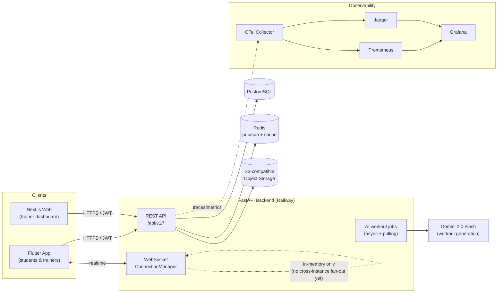

# PULSO

> **Note on this repo:** this is a **portfolio and system design study project** — not a maintained open-source product with support guarantees. A large part of the codebase was built with AI pair-programming (Claude Code), under human review and direction; that's disclosed here rather than left implicit.

PULSO is a fitness coaching platform connecting personal trainers and students: workout programming, live session tracking (heart-rate over BLE), AI-assisted workout generation, an in-app trainer marketplace, and a trainer-branded portfolio. It ships as three coordinated clients — a Flutter mobile app, a Next.js web dashboard, and a FastAPI backend.

## Why this is worth reading as a system design example

- **Async backend under real constraints**: FastAPI + SQLAlchemy async + asyncpg, with eager-loading patterns adopted specifically to avoid greenlet errors under `asyncio` — documented in `CLAUDE.md`, not just discovered by accident.
- **Real-time fan-out**: a WebSocket `ConnectionManager` (`backend/app/websockets/manager.py`) supports multiple devices per user. It's currently **in-memory per process** — a deliberate, documented trade-off that works at current scale but won't survive a second backend instance. Redis is already wired into the project for pub/sub and would be the natural next step.
- **Observability from day one, not bolted on**: OpenTelemetry Collector → Prometheus + Jaeger → Grafana, fully defined in `docker-compose.yml` and `observability/`, with a checked-in Grafana dashboard.
- **Load testing as code**: `k6/` has smoke, load, and stress test scripts, wired to push metrics into the same Prometheus instance used for observability.
- **Two parallel deployment stories**: `railway.json` drives a managed PaaS deploy (migrations-on-deploy included), while `k8s/` holds Kubernetes manifests for the same stack — useful for comparing managed-PaaS vs. self-hosted-orchestration trade-offs side by side.

## Architecture



## Tech stack

| Layer | Stack |
|---|---|
| **Backend** | FastAPI, SQLAlchemy 2.0 (async), asyncpg, Alembic, Pydantic v2, Redis, boto3 (S3-compatible storage), Google Gemini (`google-genai`) for AI workout generation |
| **Web** | Next.js 16 (App Router), React 19, TypeScript, Tailwind CSS 4, shadcn/ui, Framer Motion |
| **Mobile** | Flutter, Provider (state management), Dio, `flutter_secure_storage`, BLE for heart-rate devices |
| **Infra / Ops** | Railway (production), Kubernetes manifests (`k8s/`), Docker Compose (local), OpenTelemetry + Prometheus + Jaeger + Grafana, k6 (load testing) |
| **CI/CD** | GitHub Actions (`.github/workflows/`) for iOS builds and deploys |

## Repository layout

```
pulse_app/
├── backend/          # FastAPI + SQLAlchemy async + PostgreSQL
├── frontend/          # Next.js 16 App Router (trainer web dashboard)
├── mobile_app/        # Flutter app (students & trainers)
├── observability/      # OTel Collector, Prometheus, Grafana provisioning
├── k6/                # Load/stress/smoke test scripts
├── k8s/               # Kubernetes manifests (alternative to Railway deploy)
└── CLAUDE.md            # Contributor/AI-agent guide: local setup, conventions, architecture notes
```

## Running locally

Full setup instructions (env vars, migrations, per-client run commands) live in `CLAUDE.md`. Short version:

```bash
# Backend
cd backend && python -m venv venv && source venv/bin/activate
pip install -r requirements.txt
# copy backend/.env.example -> backend/.env and fill in the values
alembic upgrade head
uvicorn app.main:app --reload

# Observability stack (optional, for tracing/metrics locally)
docker compose up -d

# Web
cd frontend && npm install && npm run dev

# Mobile
cd mobile_app && flutter pub get && flutter run
```

## Known limitations

- WebSocket fan-out is single-process only (no Redis-backed cross-instance broadcast yet)
- Image delivery pays for an avoidable extra network hop and ships unresized originals to mobile clients
- No automated test suite yet (noted in `CLAUDE.md`)

## License

[MIT](./LICENSE) — use it, fork it, learn from it.
